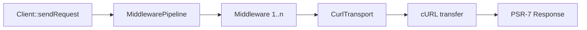

# Ariyx HTTP Client

A small, standards-based [PSR-18](https://www.php-fig.org/psr/psr-18/) HTTP client for PHP, backed by cURL.

It ships with an injectable transport, a middleware pipeline with conservative retry support, secure TLS defaults, and strict request/response validation. PSR-7 and PSR-17 interoperability is provided through [`nyholm/psr7`](https://github.com/Nyholm/psr7).

## Requirements

- PHP `^8.3` with the `curl` extension (`ext-curl`)
- [Composer](https://getcomposer.org/)

## Installation

```bash
composer require ariyx/http-client
```

## Quick start

```php
use Ariyx\HttpClient\Client;
use Nyholm\Psr7\Request;

$client = Client::create();
$response = $client->sendRequest(new Request('GET', 'https://example.com'));

echo $response->getStatusCode();
echo (string) $response->getBody();
```

`Client::create()` builds a cURL-backed client using Nyholm's PSR-17 factories. HTTP `4xx` and `5xx` responses are returned normally; only transport-level and invalid-request failures throw.

## Configuration

Pass a `CurlOptions` value object to tune timeouts, TLS verification, redirects, and the user agent:

```php
use Ariyx\HttpClient\Client;
use Ariyx\HttpClient\Transport\CurlOptions;

$client = Client::create(new CurlOptions(
    connectTimeoutMs: 5000,
    timeoutMs: 15000,
    verifyPeer: true,
    verifyHost: true,
    followRedirects: true,
    maxRedirects: 3,
    userAgent: 'my-app/1.0',
));
```

| Option | Default | Description |
| --- | --- | --- |
| `connectTimeoutMs` | `10000` | Connection timeout in milliseconds. Must not be negative. |
| `timeoutMs` | `30000` | Total request timeout in milliseconds. Must not be negative. |
| `verifyPeer` | `true` | Verify the TLS peer certificate. |
| `verifyHost` | `true` | Verify that the certificate matches the host. |
| `followRedirects` | `false` | Follow `3xx` redirects. Disabled by default. |
| `maxRedirects` | `5` | Maximum redirects to follow. Must not be negative. |
| `userAgent` | `'ariyx/http-client'` | `User-Agent` header sent with requests. Must not be empty. |

## Retrying transient failures

Add the bundled `RetryMiddleware` to retry idempotent requests with exponential backoff:

```php
use Ariyx\HttpClient\Client;
use Ariyx\HttpClient\Middleware\RetryMiddleware;

$client = Client::create(middleware: [
    new RetryMiddleware(maxAttempts: 3, baseDelayMs: 100, maxDelayMs: 1000),
]);
```

Retry behavior:

- Retries `GET`, `HEAD`, `PUT`, `DELETE`, and `OPTIONS` requests only. `POST` (and other methods) are never retried by default; pass a custom `$retryableMethods` list to change this.
- Retries responses with status `429`, `500`, `502`, `503`, or `504`. The last response is returned when attempts run out.
- Retries any `NetworkExceptionInterface` failure (for example timeouts) and rethrows the last one when attempts run out. Other client exceptions, such as invalid-request errors, are never retried.
- Honors a numeric `Retry-After` response header (in seconds), capped at `maxDelayMs`.
- Delay grows exponentially (`baseDelayMs * 2^(attempt-1)`) and is capped at `maxDelayMs`.

## Custom middleware

Implement `MiddlewareInterface` to add cross-cutting behavior such as logging or authentication. Middleware runs in the order it is declared:

```php
use Ariyx\HttpClient\Client;
use Ariyx\HttpClient\Contracts\MiddlewareInterface;
use Ariyx\HttpClient\Contracts\RequestHandlerInterface;
use Psr\Http\Message\RequestInterface;
use Psr\Http\Message\ResponseInterface;

final class AddAuthHeader implements MiddlewareInterface
{
    public function process(RequestInterface $request, RequestHandlerInterface $handler): ResponseInterface
    {
        return $handler->handle($request->withHeader('Authorization', 'Bearer <token>'));
    }
}

$client = Client::create(middleware: [new AddAuthHeader()]);
```

## Custom transports

The client delegates to any `TransportInterface` implementation, which makes testing easy:

```php
use Ariyx\HttpClient\Client;
use Ariyx\HttpClient\Contracts\TransportInterface;
use Nyholm\Psr7\Request;
use Nyholm\Psr7\Response;
use Psr\Http\Message\RequestInterface;
use Psr\Http\Message\ResponseInterface;

final class FakeTransport implements TransportInterface
{
    public function handle(RequestInterface $request): ResponseInterface
    {
        return new Response(200, [], 'hello');
    }
}

$client = new Client(new FakeTransport());
$response = $client->sendRequest(new Request('GET', 'https://example.com'));
```

For full control, construct `CurlTransport` directly with your own PSR-17 response and stream factories plus a `CurlOptions` instance.

## Request flow



## Error handling

| Situation | Behavior |
| --- | --- |
| HTTP `4xx` / `5xx` response | Returned normally, no exception. |
| Non-`http(s)` URL, missing host, invalid method or header, unreadable request body | `RequestException` (implements PSR-18 `RequestExceptionInterface`). |
| cURL initialization, configuration, or transfer failure | `NetworkException` (implements PSR-18 `NetworkExceptionInterface`). |
| Transfer timeout (`CURLE_OPERATION_TIMEDOUT`) | `TimeoutException`, which extends `NetworkException`. |
| Malformed response headers or no valid HTTP response | `ResponseException`. |

All exceptions extend `ClientException`, which implements PSR-18 `ClientExceptionInterface`.

Only absolute `http` and `https` request URIs with a host are supported.

## Local development

```bash
composer install
composer test      # PHPUnit (unit + integration)
composer analyse   # PHPStan, level max
composer cs        # PHP-CS-Fixer dry run (PER-CS)
composer cs:fix    # apply code style fixes
composer security  # composer audit
composer check     # runs cs, analyse, test, and security
```

Integration tests start their own local PHP built-in web server; no external network access is required. The project has no environment variables, application configuration, or deployment step — it is a Composer library.

Continuous integration runs the test suite on PHP `8.3`, `8.4`, and `8.5`, plus code style, static analysis, and `composer audit` (see `.github/workflows/ci.yml`).

## Changelog

See [CHANGELOG.md](CHANGELOG.md).

## License

MIT — see [LICENSE](LICENSE).
